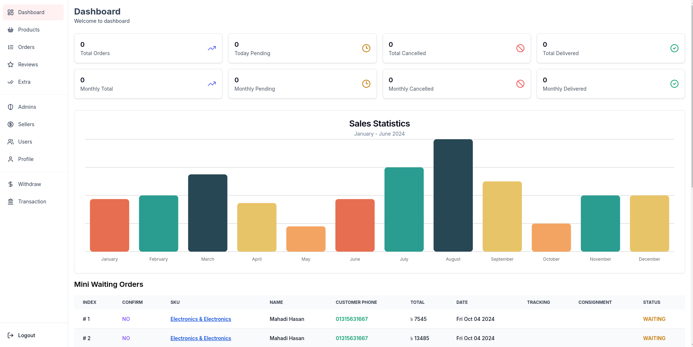
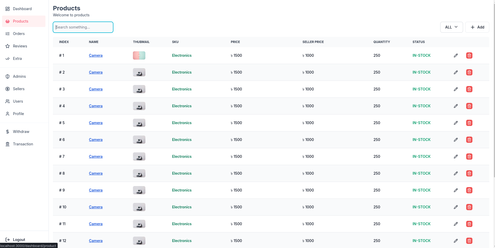
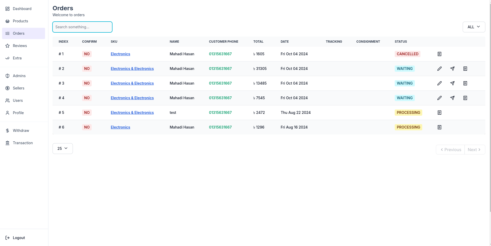
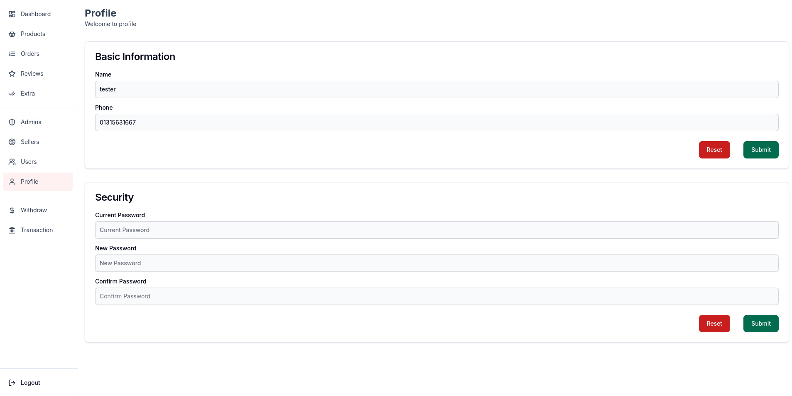

# Ladies Sign Admin

Build With Nextjs and MongoDB



### Technologies

> Frontend

1. `NextJs 14.2.2` as frontend framework
1. `Typescript` for better debugging and DX
1. `Zod` for input validation
1. `TailwindCss` for styling
1. `Flowbite UI` for ui design
1. `ChartJS` for chart purpose
1. `React form hook` for input handling

> Backend

1. `Nextjs Api` for backend
1. `Mongodb` as database
1. `server actions` for mutations

> Others

1. `nodemailer` for email sending
1. `Upload thing` for image upload service

> Security

1. `JWT` for authentication and authorization
2. `middleware` for route protection

### Installation Instructions

> First, NodeJs and pnpm are requried

```bash
npm install -g pnpm
```

> Install the the pacakges

```bash
pnpm install
```

> There is a .env.example file. Copy the content and create new .env file and
> Finally run the project with

```bash
pnpm run dev
```

### Project Preview

#### Products Page



### Orders Page



### Profile Page



<br/>
<br/>

**_NOTE :_** This repository maintain best practices and Nextjs latest features
